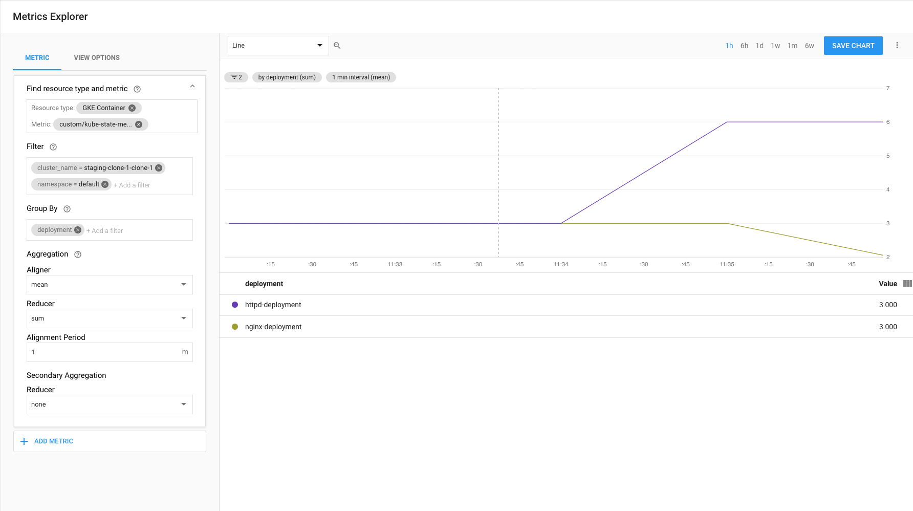

# GKE Kube State Metrics

Create namesapce and grant permissions to the `default` user on the `monitoring` namespace.

```shell
kubectl apply -f rbac-setup.yaml --as=admin --as-group=system:masters
```

the requires permissions are `list,get,watch` on:

```console
$cat perms.txt

*v1.PersistentVolume
*v1.PersistentVolumeClaim
*v1.Service
*v1.Pod
*v1.Node
*v1.ReplicationController
*v1.Endpoints
*v1beta1.Deployment
*v1beta1.CronJob
*v1.Job
*v1beta1.ReplicaSet
*v2beta1.HorizontalPodAutoscaler
*v1beta1.DaemonSet
*v1beta1.StatefulSet
*v1.LimitRange
*v1.ResourceQuota
```

## Tiller Method

```shell
# Bootstrap
kubectl create ns monitoring

# Install
curl https://raw.githubusercontent.com/helm/helm/master/scripts/get | bash

# Allow tiller to deploy
kubectl create serviceaccount tiller --namespace=monitoring
kubectl create rolebinding tiller --clusterrole=admin --serviceaccount=monitoring:tiller --namespace=monitoring

# If Tiller is not installed:
 helm init  --service-account tiller --tiller-namespace monitoring --debug
 ```


```shell
helm install stable/kube-state-metrics \
    --namespace monitoring \
    --name kube-state-metrics \
    --tiller-namespace monitoring

ENDPOINT=http://kube-state-metrics.monitoring.svc.cluster.local:8080

helm install stable/prometheus-to-sd \
    --namespace monitoring \
    --set metricsSources.kube-state-metrics=$ENDPOINT \
    --name prometheus-to-sd \
    --tiller-namespace monitoring
```

## Deployment

```shell
kubectl apply -f jamming.yaml
```

## Debug

```console
$ kubectl run my-shell -n monitoring --rm -i --tty --image ubuntu -- bash
If you don't see a command prompt, try pressing enter.
root@my-shell-796b6f7d5b-6qxmc:/# apt-get update -qy && apt-get install dnsutils curl -qy
root@my-shell-796b6f7d5b-6qxmc:/# curl kube-state-metrics:8080
<html>
             <head><title>Kube Metrics Server</title></head>
             <body>
             <h1>Kube Metrics</h1>
                         <ul>
             <li><a href='/metrics'>metrics</a></li>
             <li><a href='/healthz'>healthz</a></li>
                         </ul>
             </body>
             </html>
curl http://kube-state-metrics.monitoring.svc.cluster.local:8080
<html>
             <head><title>Kube Metrics Server</title></head>
             <body>
             <h1>Kube Metrics</h1>
                         <ul>
             <li><a href='/metrics'>metrics</a></li>
             <li><a href='/healthz'>healthz</a></li>
                         </ul>
             </body>
             </html>
```

```console
$ kubectl apply -f https://gist.githubusercontent.com/kmassada/ad766d49e2616d9f8d1cc44285bcab56/raw/7d7f410e3465f2f255eb37bee59dfe78fd5c61a8/fanout-ingress.yml
deployment.apps "nginx-deployment" created
deployment.apps "httpd-deployment" created
service "nginx-service" created
service "httpd-service" created
ingress.extensions "fanout-ingress-gce" created
$ kubectl scale --replicas=6 deployment.apps "httpd-deployment"
deployment.apps "httpd-deployment" scaled
$ kubectl scale --replicas=2 deployment.apps "nginx-deployment"
deployment.apps "nginx-deployment" scaled
```

